# chen-2011-spherical-flames-gaia

Gaia knowledge package formalizing Chen (2011) *"On the extraction of laminar
flame speed and Markstein length from outwardly propagating spherical
flames,"* together with the 2026-04-09 Bohrium reproduction trace
(`chen-2011-cnf-158`).

> **Original work:** Chen, Z. *On the extraction of laminar flame speed and
> Markstein length from outwardly propagating spherical flames.* Combustion
> and Flame **158**(2), 291–300 (2011).
> DOI: [10.1016/j.combustflame.2010.09.001](https://doi.org/10.1016/j.combustflame.2010.09.001)

> [!NOTE]
> This README is an AI-generated analysis based on a
> [Gaia](https://github.com/SiliconEinstein/Gaia) reasoning-graph formalization
> of the original work plus an independent 2026 reproduction. Belief values
> reflect the graph's probabilistic assessment of each claim's support given
> the declared priors — not the original author's confidence. See
> [ANALYSIS.md](ANALYSIS.md) for full verification details.

## Summary

Chen (2011) revisits a forty-year-old problem in combustion diagnostics:
extracting the *unstretched* laminar flame speed $S_L^{0}$ and Markstein
length $L_b$ from the radius-vs-time trace of an outwardly propagating
spherical flame (OPS). Using the residual-based error definition of his
Eq. 6, Chen ranks three stretch-extrapolation models — linear (LM),
non-linear method I (NMI) and method II (NMII) — by the magnitudes of their
errors against a detailed-chemistry reference, finding
$|\varepsilon_{\text{NMI}}| < |\varepsilon_{\text{NMII}}| < |\varepsilon_{\text{LM}}|$ for $\mathrm{Le} \ne 1$
and zero error for all three at $\mathrm{Le} = 1$, and argues that NMI is
only safe when the fitting window is restricted to $R_f > 1.5\,\text{cm}$.
This package formalizes those five methodological claims **and** an
independent 2026 Bohrium reproduction that runs Cantera 3.0 FreeFlame
(H2/air) and pyASURF spherical-flame simulations (H2/air and CH4/air). The
graph returns posterior 0.832 for *"Chen 2011 is reproducible with open 2026
tooling"* (vs 0.10 for the counter-hypothesis), while also showing that
the apparent Fig. 4 sign-flip during reproduction was not a real
discrepancy but a convention mismatch between naive relative error and the
paper's Eq. 6 residual (posterior 0.001 vs 0.978 after the contradiction
operator fires).

## Overview

> [!TIP]
> **Reasoning graph information gain: `2.5 bits`**
>
> Total mutual information between leaf premises and exported conclusions —
> measures how much the reasoning structure reduces uncertainty about the
> results.

```mermaid
---
config:
  flowchart:
    rankSpacing: 80
    nodeSpacing: 30
---
graph TB
    error_zero_at_le1["★ Zero error at Le=1 (all three models)\n(0.50 → 0.97)"]:::exported
    error_ordering_le_ne_1["★ Error ordering NMI < NMII < LM at Le ≠ 1\n(0.50 → 0.77)"]:::exported
    lb_vanishes_at_le1["Markstein length vanishes at Le=1\n(0.96 → 0.96)"]:::premise
    nq_window_requirement["★ NQ fitting window Rf > 1.5 cm (paper)\n(0.50 → 0.98)"]:::exported
    paper_lb_phi4_value["Paper Lb value at phi = 4.0 (H2/air)\n(0.97 → 0.98)"]:::premise
    repro_lb_phi4_tight_window_fails["Reproduction — NMI with Rf > 1.0 cm yields negative Lb\n(0.94 → 0.96)"]:::premise
    repro_lb_phi4_fixed_window_matches["Reproduction — NMI with Rf > 1.5 cm matches paper\n(0.94 → 0.96)"]:::premise
    paper_sl_phi1["Paper S_L at phi = 1.0 (H2/air)\n(0.97 → 0.98)"]:::premise
    paper_sl_phi2["Paper S_L at phi = 2.0\n(0.97 → 0.98)"]:::premise
    paper_sl_phi4["Paper S_L at phi = 4.0\n(0.97 → 0.98)"]:::premise
    cantera_sl_phi1["Cantera S_L at phi = 1.0\n(0.95 → 0.97)"]:::premise
    cantera_sl_phi2["Cantera S_L at phi = 2.0\n(0.95 → 0.97)"]:::premise
    cantera_sl_phi4["Cantera S_L at phi = 4.0\n(0.95 → 0.97)"]:::premise
    agreement_phi1["Agreement at phi = 1.0\n(0.50 → 1.00)"]:::premise
    agreement_phi2["Agreement at phi = 2.0\n(0.50 → 1.00)"]:::premise
    agreement_phi4["Agreement at phi = 4.0\n(0.50 → 1.00)"]:::premise
    cantera_validates_paper_sl["★ Cantera reproduces paper S_L to ±2 % (H2/air)\n(0.50 → 0.97)"]:::exported
    pyasurf_phi14_sb_noisy["pyASURF phi = 1.4 AMR-6 result is noisy (R² = 0.555)\n(0.93 → 0.93)"]:::premise
    pyasurf_phi06_amr6["pyASURF phi = 0.6 AMR-6 clean\n(0.93 → 0.93)"]:::premise
    amr_level8_grid_indep["Grid independence at AMR level 8 (Δ < 0.5 %)\n(0.92 → 0.92)"]:::premise
    soret_rich_h2_neglig["Soret effect < 2 % at phi = 4.0 rich H2\n(0.92 → 0.92)"]:::premise
    ignition_kernel_constraint["Ignition kernel constraint dx_base < 2 R_kernel\n(0.88 → 0.88)"]:::premise
    large_mech_impractical["Large mechanisms (>15 sp) are impractical in pyASURF\n(0.85 → 0.85)"]:::premise
    pyasurf_fig3_curves["pyASURF Fig. 3 — raw error-convergence curves\n(0.93 → 0.95)"]:::premise
    pyasurf_fig7_deltas["pyASURF Fig. 7 — raw model-spread numbers at Le=3\n(0.92 → 0.95)"]:::premise
    repro_fig3_ordering["Reproduction Fig. 3 — ordering confirmed\n(0.50 → 0.99)"]:::premise
    repro_fig7_relative["Reproduction Fig. 7 — quantitative match at Le=3\n(0.50 → 0.99)"]:::premise
    reproduction_lessons["★ Four pipeline lessons (OPS reproducibility check-list)\n(0.50 → 0.74)"]:::exported
    paper_taylor_phi134["Paper NMI extraction of Taylor phi = 1.34\n(0.95 → 0.97)"]:::premise
    repro_taylor_phi134["Reproduction NMI extraction of Taylor phi = 1.34\n(0.93 → 0.95)"]:::premise
    taylor_reanalysis_agreement["★ Taylor re-analysis reproduced to 0.1 % at phi = 1.34\n(0.50 → 0.98)"]:::exported
    qg_11_accept["QG — 11/13 figures ACCEPT on first pass\n(0.95 → 0.95)"]:::premise
    qg_fig9_partial["QG — Fig 9 PARTIAL → ACCEPT under relaxed policy\n(0.93 → 0.93)"]:::premise
    qg_fig4_fix["QG — Fig 4 REJECT → ACCEPT after Eq. 6 fix\n(0.95 → 0.95)"]:::premise
    fig1_skipped["Fig 1 — intentionally skipped\n(0.97 → 0.97)"]:::premise
    reproduction_13_of_14["★ Overall — 13/14 figures reproduced\n(0.50 → 0.89)"]:::exported
    chen2011_reproducible["★ Chen 2011 methodology is reproducible (top-level conclusion)\n(0.50 → 0.83)"]:::exported
    strat_0(["infer\n0.71 bits"]):::weak
    agreement_phi1 --> strat_0
    agreement_phi2 --> strat_0
    agreement_phi4 --> strat_0
    cantera_sl_phi1 --> strat_0
    cantera_sl_phi2 --> strat_0
    cantera_sl_phi4 --> strat_0
    chen2011_reproducible --> strat_0
    paper_sl_phi1 --> strat_0
    paper_sl_phi2 --> strat_0
    paper_sl_phi4 --> strat_0
    strat_0 --> cantera_validates_paper_sl
    strat_1(["infer\n0.28 bits"]):::weak
    amr_level8_grid_indep --> strat_1
    ignition_kernel_constraint --> strat_1
    large_mech_impractical --> strat_1
    pyasurf_phi06_amr6 --> strat_1
    pyasurf_phi14_sb_noisy --> strat_1
    soret_rich_h2_neglig --> strat_1
    strat_1 --> reproduction_lessons
    strat_2(["infer\n0.42 bits"]):::weak
    cantera_validates_paper_sl --> strat_2
    nq_window_requirement --> strat_2
    taylor_reanalysis_agreement --> strat_2
    strat_2 --> chen2011_reproducible
    strat_3(["infer\n0.15 bits"]):::weak
    chen2011_reproducible --> strat_3
    paper_lb_phi4_value --> strat_3
    repro_lb_phi4_fixed_window_matches --> strat_3
    repro_lb_phi4_tight_window_fails --> strat_3
    strat_3 --> nq_window_requirement
    strat_4(["infer\n0.13 bits"]):::weak
    chen2011_reproducible --> strat_4
    paper_taylor_phi134 --> strat_4
    repro_taylor_phi134 --> strat_4
    strat_4 --> taylor_reanalysis_agreement
    strat_5(["infer\n0.25 bits"]):::weak
    fig1_skipped --> strat_5
    qg_11_accept --> strat_5
    qg_fig4_fix --> strat_5
    qg_fig9_partial --> strat_5
    strat_5 --> reproduction_13_of_14
    strat_6(["infer\n0.09 bits"]):::weak
    lb_vanishes_at_le1 --> strat_6
    strat_6 --> error_zero_at_le1
    strat_7(["infer\n0.52 bits"]):::weak
    pyasurf_fig3_curves --> strat_7
    pyasurf_fig7_deltas --> strat_7
    repro_fig3_ordering --> strat_7
    repro_fig7_relative --> strat_7
    strat_7 --> error_ordering_le_ne_1

    classDef premise fill:#ddeeff,stroke:#4488bb,color:#333
    classDef exported fill:#d4edda,stroke:#28a745,stroke-width:2px,color:#333
    classDef weak fill:#fff9c4,stroke:#f9a825,stroke-dasharray: 5 5,color:#333
    classDef contra fill:#ffebee,stroke:#c62828,color:#333
```

> [!NOTE]
> **[Per-module reasoning graphs with full claim details →](docs/detailed-reasoning.md)**
>
> Seven Mermaid diagrams (motivation + six thematic modules s1–s6) with every
> claim, strategy, and belief value — handy when reviewing a specific pillar
> (e.g. just the Cantera validation chain or just the QG audit).

## Reasoning Structure

The nine exported conclusions are ordered below by the paper's logical arc
(definition → theoretical consequences → practical constraint →
computational validation → literature re-analysis → QG audit →
reproducibility), not by belief value. Beliefs in parentheses are the
junction-tree posteriors at IR hash `sha256:0b200926f…`.

### 1. Each model's extraction error is defined as an equation residual, not naive relative error (belief: 0.969)

Chen's Eq. 6 defines the error of each stretch-extrapolation model as the
residual of the model's own extraction equation evaluated at the exact
synthetic-model (SM) solution — e.g. for LM, $\varepsilon_{\text{LM}} = U - 1 + L^{0}(2U/R)$.
This is *not* the naive $(U_{\text{model}} - U_{\text{DM}})/U_{\text{DM}}$
some readers will reach for by reflex; the distinction turns out to matter
later (see §7). The package places this definition at prior 0.97 because it
is a convention choice that must be taken from the paper text rather than
derived.

- **Convention transparency** (weakest link, belief 0.97): anyone
  reproducing Fig. 4 must use Eq. 6 verbatim. Using the naive relative
  error gives a sign-inverted curve (Hypothesis A = 0.001 in this graph).

> Well-posed but fragile for readers who skip Section 3.1 of the paper —
> the 2026 reproduction hit exactly this failure mode at Fig. 4.

### 2. At $\mathrm{Le} = 1$, $L_b$ vanishes and all three models give the exact $S_L^{0}$ (belief: 0.970)

With unit Lewis number the flame has no stretch sensitivity
($L_b \to 0$), so LM, NMI and NMII all converge to the same unstretched
flame speed and their Eq. 6 residuals are identically zero. This is a
theoretical degeneracy rather than an empirical observation.

- **Theorem-style premise** (weakest link, belief 0.96): the
  `lb_vanishes_at_le1` premise is a combustion-theory result. The package
  imports it as a prior; a future revision could consume it from a
  dedicated `gaia-combustion-theory` package and derive it instead.

> Robust: no competing hypothesis and no reproduction step can falsify
> this.

### 3. For $\mathrm{Le} \ne 1$ the error ordering $|\varepsilon_{\text{NMI}}| < |\varepsilon_{\text{NMII}}| < |\varepsilon_{\text{LM}}|$ holds (belief: 0.769)

This is the paper's central methodological claim. NMI (which retains the
full non-linear curvature term) gives the smallest residual; LM (which
drops all curvature terms) gives the largest; NMII sits in between.
Figures 3, 4 and 7 of Chen 2011 display this ordering across multiple
mixtures.

- **Fig. 3 reproduction** (belief 0.988): independent pyASURF runs
  confirm the NMI < NMII < LM ordering of the error-convergence curves.
- **Fig. 7 quantitative match at Le = 3** (belief 0.985): the
  model-spread numbers agree with the paper within quoted uncertainty.
- **Inductive premises** (weakest link, belief ≈ 0.92): the raw pyASURF
  observations (`pyasurf_fig3_curves`, `pyasurf_fig7_deltas`) carry
  priors 0.93 and 0.92 respectively, and the induction strategy that
  lifts them into the `error_ordering_le_ne_1` law requires two
  near-independent generative pillars. A third pillar (e.g. an explicit
  Fig. 5 $L_b$-vs-$\phi$ reproduction) would raise this to > 0.85.

> The moderate belief (0.77) reflects evidence quantity, not evidence
> quality: each supporting observation is strong on its own, but two
> pillars against a prior of 0.5 gives a posterior in the 0.7–0.8 band.

### 4. The NQ fit must exclude small radii: $R_f > 1.5\,\text{cm}$ for $\mathrm{Le} > 1$ (belief: 0.976)

Paper Section 3.2 requires that NMI be fit only to the portion of the
$R_f(t)$ trajectory with $R_f > 1.5\,\text{cm}$. For rich H2/air
($\phi = 4.0$, $\mathrm{Le} > 1$) the trace shows a concrete
failure-and-fix cycle: a tighter window ($R_f > 1.0\,\text{cm}$)
yields *negative* $L_b$ values from NMI; sliding to the paper's
$R_f > 1.5\,\text{cm}$ cutoff recovers the paper's $L_b$.

- **Failure arm** (belief 0.96): the reproduction actually reproduced
  the failure mode — negative $L_b$ at tight windows — not just the
  success arm. This is unusually strong evidence for the rule.
- **Success arm** (belief 0.96): matching the paper's $L_b$ at $\phi =
  4.0$ H2/air when the window is re-opened to 1.5 cm.

> High-confidence conclusion anchored by an explicit counter-factual
> (what happens when you violate the rule).

### 5. Cantera 3.0 FreeFlame reproduces Chen's H2/air $S_L^{0}$ to $\pm 2\%$ (belief: 0.971)

The tier-1 validation gate: an independent Cantera `FreeFlame` with
mixture-averaged transport and the Li 2004 mechanism reproduces the
paper's H2/air flame speeds to within 2 % at $\phi \in \{1.0, 2.0, 4.0\}$.
This checks that the mechanism, transport, and initial conditions declared
in the paper are internally consistent — without touching the
spherical-flame stretch-extrapolation machinery at all.

- **Three matched $\phi$ points** (beliefs 1.000): `agreement_phi1/2/4`
  all converged to unity after BP propagated the two directly-observed
  numerical premises (paper value, Cantera value) through the induction.
- **Mechanism dependence** (not tested): the whole validation uses Li
  2004. A cross-mechanism check with Ó Conaire 2004 would decouple
  "Chen's numbers are right" from "Li 2004 happens to agree with the
  paper."

> Near-certain conclusion (0.971). The one unresolved risk is mechanism
> selection bias.

### 6. Taylor's 1991 $\phi = 1.34$ point reproduces to 0.1 % (belief: 0.982)

Tier-2 literature validation: digitising Taylor's 1991 PhD-thesis
CH4/air datum and running the paper's own NMI extraction reproduces the
$S_b^{0}$ reported in Chen 2011 to 0.1 %, well inside any plausible
digitisation tolerance. This pillar stress-tests the extraction code on
raw external data, not just paper-internal numbers.

- **Numerical anchor** (weakest link, belief 0.95): the reproduction's
  own NMI extraction of Taylor's data carries prior 0.93; the paper's
  value carries prior 0.95. Both are direct observations, so the
  induction ends at near-unity.

> Belief 0.98 — as strong as any single-point validation in this graph.

### 7. 13 of the paper's 14 figures reproduce under the Quality-Gate audit (belief: 0.886)

Figure-by-figure QG audit. Eleven of the thirteen reproducible figures
ACCEPT on the first pass; Fig. 4 ACCEPTs after the Eq. 6 fix (see §1);
Fig. 9 ACCEPTs under a relaxed ±20 % tolerance policy rather than the
default strict match. Fig. 1 is deliberately excluded (a
literature-survey schematic, not a reproducible numerical result).

- **First-pass pass rate** (belief 0.95): 11/13 ACCEPTed without
  intervention.
- **Fig. 4 fix** (belief 0.95): convention switch from naive relative
  error to Eq. 6 residuals.
- **Fig. 9 under relaxed policy** (weakest link, belief 0.93): the
  ±20 % envelope is a policy choice, not a strict reproduction.

> The 0.89 posterior is the least certain of the "how many figures
> worked" conclusions because one of the four supporting premises
> (Fig. 9) invoked a policy relaxation rather than a clean match.

### 8. Four pipeline lessons are the necessary OPS-reproduction check-list (belief: 0.744)

Distilled from concrete failure-and-fix cycles in the reproduction
trace: (1) $\Delta x_{\text{base}} < 2\,R_{\text{kernel}}$ for
the ignition source, (2) AMR level $\ge 7$ for $L_b$ accuracy on thin
CH4/air flames, (3) Soret mass-diffusion retained for rich H2, and
(4) mechanism size $\le$ ~15 species for tractable pyASURF wall-time.
Each lesson is independently well-supported, but the compound claim is
penalised by multiplication.

- **Ignition kernel constraint** (belief 0.88) — forced by the very
  first ignition-failure cycle.
- **AMR level 8 grid independence** (belief 0.92) — direct Δ < 0.5 %
  observation between AMR-7 and AMR-8.
- **Soret effect < 2 %** (belief 0.92) — measured on rich-H2
  $\phi = 4.0$ runs.
- **Large mechanisms impractical** (weakest link, belief 0.85) — a
  scoping claim; the boundary is fuzzy and a GRI-Mech 3.0 Cantera run
  successfully despite nominally exceeding 15 species (see §7 of
  ANALYSIS.md).

> Belief 0.74 is a transparent reflection of the four-way conjunction
> structure; splitting the compound into four independent exported
> claims would push each above 0.85 at the cost of a wordier API.

### 9. Chen 2011's methodology is reproducible in 2026 with open tooling (belief: 0.832)

The top-level conclusion, derived inductively from the three
methodological pillars above — Cantera H2/air validation (§5), Taylor
re-analysis (§6), and the NQ-window failure-and-fix (§4) — with
additional bottom-up support from the QG audit (§7). The counter-
hypothesis `chen2011_not_reproducible` remains at its 0.10 prior, giving
a posterior odds ratio of roughly 8 : 1 in favour of reproducibility.

- **Inductive pillar #1** — Cantera H2/air (belief 0.971)
- **Inductive pillar #2** — Taylor 1991 re-analysis (belief 0.982)
- **Inductive pillar #3** — NQ-window failure-and-fix (belief 0.976)
- **QG bottom-up support** (belief 0.886)

> The package's top-level export is deliberately conditioned on the four
> pipeline lessons of §8: *"Chen's methodology is reproducible **given**
> you run it at AMR ≥ 7, keep Soret on, stay under ~15 species, and
> respect the ignition-kernel constraint."* Violating any lesson is
> sufficient to drop the reproduction into the failure mode demonstrated
> by the tight-window NMI case of §4.

## Conclusions

| Label | Content | Prior | Belief |
|-------|---------|-------|--------|
| cantera_validates_paper_sl | An independent Cantera `FreeFlame` computation using the Li 2004 mechanism an... | 0.50 | 0.97 |
| chen2011_reproducible | The methodological conclusions of Chen 2011 — the three stretch-extrapolation... | 0.50 | 0.83 |
| error_def_residual_eq6 | The paper defines each model's extraction error as the equation residual of t... | 0.97 | 0.97 |
| error_ordering_le_ne_1 | For $\mathrm{Le} \neq 1$, the magnitudes of the residual-based extraction err... | 0.50 | 0.77 |
| error_zero_at_le1 | At Lewis number $\mathrm{Le} = 1$, the flame-speed response has no stretch de... | 0.50 | 0.97 |
| nq_window_requirement | Paper Section 3.2 requires that the NQ (nonlinear, NMI-based) extraction be f... | 0.50 | 0.98 |
| reproduction_13_of_14 | Overall reproduction outcome: 13 of the paper's 14 figures are reproducible (... | 0.50 | 0.89 |
| reproduction_lessons | The reproduction campaign establishes four pipeline-level lessons that are ne... | 0.50 | 0.74 |
| taylor_reanalysis_agreement | The reproduction's independent digitisation and NMI extraction of Taylor 1991... | 0.50 | 0.98 |

## Weak Points

Weak Points Analysis

**Executive summary.** The single weakest internal link is
`large_mech_impractical` (belief 0.85) — a scoping claim about pyASURF's
tractable mechanism size, on which the fourth pipeline lesson rests. Its
weakness then propagates through the conjunctive `reproduction_lessons`
claim (0.74) and into the conditional caveat that qualifies the top-level
reproducibility conclusion.

**Compound-conjunction bottleneck.** `reproduction_lessons` (0.74) sits
immediately below the top-level `chen2011_reproducible` conclusion and
folds four pipeline constraints into a single compound claim via a
conjunction-style induction. The belief is limited by the weakest
component (0.85) and multiplied by the others; no single pipeline
constraint is poorly supported, but the conjunctive structure itself is
the bottleneck. Splitting into four exported claims would push every
posterior above 0.85. The trade-off — compactness vs single-number
strength — was chosen in favour of compactness so the caveat can be
stated as one sentence; this is documented here for transparency.

**Scoping claim: `large_mech_impractical` (0.85).** The assertion that
mechanisms with $>$ ~15 species are impractical in pyASURF is
observationally supported (GRI-Mech 3.0 was intractable on the
spherical-flame runs), but it is at odds with the companion observation
that *Cantera* ran GRI-Mech 3.0 at $\phi = 1.0$ CH4/air without issue. The
resolution — "impractical" applies to pyASURF AMR runs, not to 1-D
Cantera — is real but not encoded as a regime-distinction in the factor
graph. An explicit `setting(simulator="pyASURF" vs "Cantera")`-split
would strengthen this pillar.

**Inductive-pillar thinness for error-ordering (0.77).** The central
methodological claim `error_ordering_le_ne_1` is supported by exactly two
reproduction pillars (Fig. 3 ordering and Fig. 7 Le-= 3 numbers). The
moderate posterior is a direct reflection of that: two
corroborating-but-not-independent pillars against a 0.5 prior. A third
pillar — explicitly reproducing Fig. 5 ($L_b$ vs $\phi$ for all three
models, H2/air) — would raise the posterior above 0.85. The trace did
not attempt Fig. 5 because the initial QG audit placed it in the same
class as Fig. 3, but the reasoning graph is a stricter reviewer.

**Uncorroborated AMR-sensitivity prediction (0.78).** `pred_amr7_needed`
— "the error ordering is real physics, so AMR ≥ 7 should *reduce*
errors, not merely change them" — sits at its prior (0.78) because its
intended abductive link to the observed 86 % → < 5 % $L_b$-error drop
was removed (see §5b of `ANALYSIS.md`). The evidence for this prediction
is qualitatively strong; it is just not formally wired into the
reasoning graph. This is the one place where the graph deliberately
under-credits the available evidence.

**Structural observation.** The graph has one genuine bottleneck
(`reproduction_lessons`) and no long serial chains; all top-level
conclusions are at most two inductive layers above their raw-observation
premises. Uncertainty therefore does not amplify through deep chains — the
moderate posteriors (0.74, 0.77) come from evidence sparsity, not from
compounding.

## Evidence Gaps

Evidence Gaps & Future Work

**Experimental gaps.**

- *Second $\phi$ outside [0.6, 1.4] for CH4/air.* Would pin down the
  regime boundary at which AMR level 6 becomes adequate, retiring
  `amr_regime_dependence` as the sole bridge between `pyasurf_phi06_amr6`
  (clean) and `pyasurf_phi14_sb_noisy` (noisy). Estimated cost: 4–8
  Bohrium-CPU-hours with GRI30_noNOx. Most directly improves
  `reproduction_lessons` (currently 0.74).
- *Fig. 5 reproduction* ($L_b$ vs $\phi$, all three models, H2/air).
  Adds a third induction pillar for `error_ordering_le_ne_1`; expected
  posterior lift 0.77 → > 0.85. Estimated cost: 12–24 CPU-hours for the
  full $\phi$-sweep.
- *Cross-mechanism check* (e.g. Ó Conaire 2004 vs Li 2004 for H2/air).
  Decouples "Chen's numbers are right" from "Li 2004 agrees with the
  paper." 1–2 CPU-hours per mechanism; strengthens
  `cantera_validates_paper_sl` and the tier-1 gate overall.

**Computational gaps.**

- The reproduction runs H2/air only at $P = 1\,\text{atm}$ for
  quantitative comparison; the $P \in \{0.5, 2\}\,\text{atm}$ arms of
  Fig. 9 were qualitatively audited but not exhaustively refined.
  Extending quantitative reproduction to all three pressures would
  retire the dependency on the relaxed ±20 % QG policy and tighten
  `reproduction_13_of_14` (0.886 → > 0.95).
- CH4/air mixtures were run with GRI30_noNOx (53 species) via a lean
  pruning protocol. A full GRI30 reproduction at at least one condition
  would falsify or confirm the `large_mech_impractical` boundary (§7 of
  ANALYSIS.md).

**Theoretical gaps.**

- `lb_vanishes_at_le1` is currently a priored axiom. It is in fact
  derivable from the stretch-response theory in Chen's own §2; adding a
  dedicated `gaia-combustion-theory` package (or an internal derivation
  module) would promote it from "premise with prior 0.96" to "derived
  theorem with belief ≥ 0.99."
- `pred_amr7_needed` vs `pred_amr_resolution_insensitive` cannot be
  discriminated by the present bare-hypothesis `compare` operator, which
  required numerically-distinct predictions (e.g. "$L_b$ error drops
  by ≥ 10×" vs "≤ 2×"). Reformulating both as numerical predictions and
  re-wiring via `abduction(pred_h, pred_alt, compare)` would convert
  qualitative AMR evidence into a formal A/B contest and resolve the
  orphan status of `pred_amr7_needed` (currently still at its 0.78
  prior).

## Detailed Analysis

For structural-integrity verification (formalization Pass 5), standalone
readability checks (Pass 6), the full BP diagnostic (convergence,
treewidth, per-operator behaviour), and the contradictions /
unmodeled-tensions catalogue, see [ANALYSIS.md](ANALYSIS.md).

Per-module reasoning graphs (motivation + s1–s6) with every claim,
strategy, and belief value are in
[docs/detailed-reasoning.md](docs/detailed-reasoning.md).
