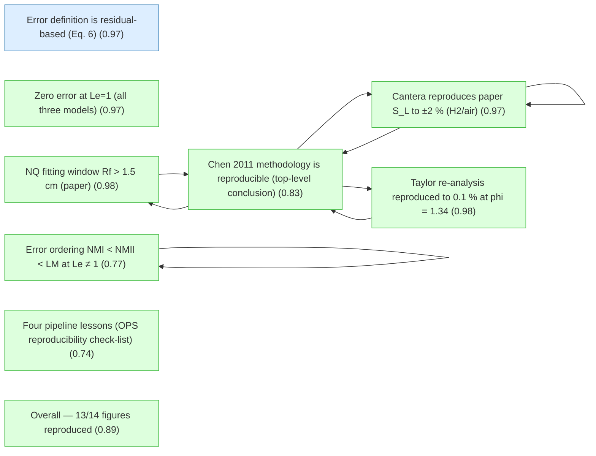
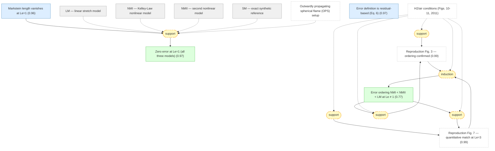
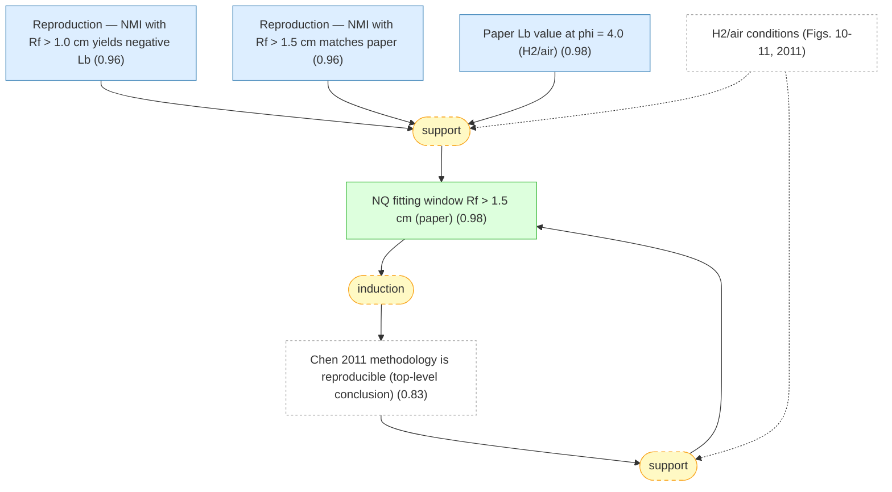
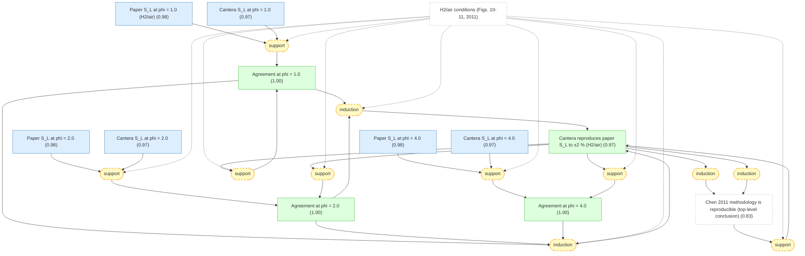
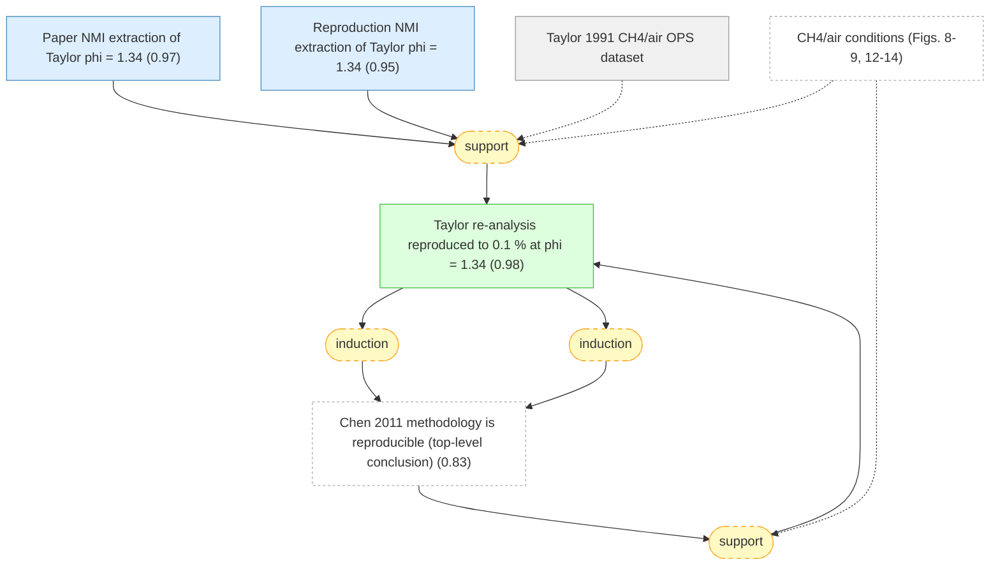

# chen-2011-spherical-flames-gaia

Gaia knowledge package formalizing Chen (2011) 'Extraction of laminar flame speed and Markstein length from outwardly propagating spherical flames' (Combust. Flame 158, 291–300) together with the 2026-04-09 Bohrium reproduction trace (chen-2011-cnf-158).

## Overview

## Motivation — setup and research question for Chen 2011 reproduction.

#### Outwardly propagating spherical flame (OPS) setup

📋 `spherical_flame_setup`

> An outwardly propagating spherical (OPS) flame is ignited at the centre of a closed chamber. The flame-front radius $R_f(t)$ is tracked as a function of time; from the trajectory one extracts the unstretched laminar flame speed with respect to burned gas $S_b^0$ and the Markstein length with respect to burned gas $L_b$. Stretch rate is $K = (2/R_f)\,dR_f/dt$.

#### H2/air conditions (Figs. 10-11, 2011)

📋 `setup_h2_air`

> Hydrogen/air mixture at initial temperature $T_u = 298$ K, pressure $P = 1$ atm, equivalence ratio $\phi \in \{0.7, 1.0, 2.0, 3.0, 4.0, 5.0\}$. Kinetic mechanism: Li et al. 2004 [@Li2004] (10 species, 21 reactions). Transport: mixture-averaged with Soret (thermal diffusion) term retained. Spherical domain $r \in [0, 50]$ cm.

#### CH4/air conditions (Figs. 8-9, 12-14)

📋 `setup_ch4_air`

> Methane/air mixture at $T_u = 298$ K, $\phi \in [0.6, 1.4]$, pressures $P \in \{0.5, 1.0, 2.0\}$ atm. Kinetic mechanism: GRI-Mech 3.0 (53 species) or the reduced GRI30_noNOx_36sp variant (36 species, NOx removed). Used for Figs. 8, 9, and for cross-checking against Taylor 1991 data [@Taylor1991].

#### Research question

❓ `research_question`

> Given a measured $R_f(t)$ trajectory from an outwardly propagating spherical flame, which stretch-extrapolation model yields the most accurate unstretched laminar flame speed $S_L^0$ and Markstein length $L_b$, and over what fitting window is each model reliable?

#### Reproduction question (this package)

❓ `reproduction_task`

> Are the methodological conclusions of Chen 2011 (three-model error ordering, Markstein-length behaviour, NQ fitting-window requirement, residual-based error definition in Eq. 6) reproducible using independent Cantera FreeFlame reference runs and pyASURF / Fortran ASURF spherical flame simulations in 2026?

## S1 — Three stretch-extrapolation models (LM, NMI, NMII).

#### LM — linear stretch model

📋 `def_lm`

> Linear model (LM, also called linear extrapolation, LC): $S_b = S_b^{0} - L_b \, K$, where $S_b$ is the burned-gas flame speed, $S_b^{0}$ the unstretched flame speed, $L_b$ the Markstein length with respect to burned gas, and $K = (2/R_f)\,dR_f/dt$ the stretch rate.

#### NMI — Kelley-Law nonlinear model

📋 `def_nmi`

> Nonlinear model I (NMI), due to Kelley-Law [@KelleyLaw2009]: the implicit relation $(S_b/S_b^{0})^{2}\,\ln\!\big[(S_b/S_b^{0})^{2}\big] = -2\, L_b\, K / S_b^{0}$. Used in the 'NQ' (nonlinear quasi-steady) extraction procedure.

#### NMII — second nonlinear model

📋 `def_nmii`

> Nonlinear model II (NMII): a different nonlinear form derived from asymptotic analysis of the quasi-steady stretched flame. Explicit functional form is given in the paper [@Chen2011]; for the purpose of this package it suffices to distinguish it from LM and NMI as a third extrapolation scheme.

#### SM — exact synthetic reference

📋 `def_sm`

> Synthetic Model (SM): the implicit equation $f \ln f = c$ used by the paper as an exact reference. Given $c$, solving for $f$ gives the exact (unstretched) burned-gas flame speed; LM, NMI and NMII are asymptotic approximations to this reference, making SM the natural benchmark.

#### Error definition is residual-based (Eq. 6) ★

📌 `error_def_residual_eq6`   |   Prior: 0.97   |   Belief: **0.97**

> The paper defines each model's extraction error as the equation residual of the model evaluated at the exact SM solution (Eq. 6 of [@Chen2011]): LM residual: $U - 1 + L^{0}\,(2U/R)$; NMI residual: $U - 1 + L^{0}\,(2/R)$; NMII residual: $\ln(U) + L^{0}\,(2/(R\,U))$. This is a *residual* definition, not the naive relative error $(U_{\text{model}} - U_{\text{DM}})/U_{\text{DM}}$.

#### Zero error at Le=1 (all three models) ★

📌 `error_zero_at_le1`   |   Belief: **0.97**

> At Lewis number $\mathrm{Le} = 1$, the flame-speed response has no stretch dependence ($L_b \to 0$), so LM, NMI and NMII all give the exact unstretched flame speed — the extraction error is zero for all three models.

🔗 **support**([Markstein length vanishes at Le=1](#lb_vanishes_at_le1))

Reasoning

At $\mathrm{Le}=1$ the Markstein length $L_b$ vanishes (@lb_vanishes_at_le1). Substituting $L_b = 0$ into the LM, NMI and NMII definitions (@def_lm, @def_nmi, @def_nmii) reduces each to $S_b = S_b^{0}$, which exactly matches the SM reference (@def_sm). Hence all three residuals vanish identically (@error_zero_at_le1).

#### Error ordering NMI < NMII < LM at Le ≠ 1 ★

📌 `error_ordering_le_ne_1`   |   Belief: **0.77**

> For $\mathrm{Le} \neq 1$, the magnitudes of the residual-based extraction errors of the three models obey $|\varepsilon_{\mathrm{NMI}}| \,<\, |\varepsilon_{\mathrm{NMII}}| \,<\, |\varepsilon_{\mathrm{LM}}|$: the linear model has the largest error, NMI the smallest. In the paper this ordering is shown in Figs. 3, 4 and 7.

🔗 **induction**([Reproduction Fig. 3 — ordering confirmed](#repro_fig3_ordering), [Reproduction Fig. 7 — quantitative match at Le=3](#repro_fig7_relative))

Reasoning

Fig. 3 (SM-benchmark convergence at fixed Le) and Fig. 7 (Le-sweep of relative differences between models) use different problem setups and different figures of merit; agreement from both is a genuinely independent pair of confirmations for the paper's error-ordering law.

#### Markstein length vanishes at Le=1

📌 `lb_vanishes_at_le1`   |   Prior: 0.96   |   Belief: **0.96**

> At Lewis number $\mathrm{Le} = 1$, the Markstein length $L_b$ vanishes: the flame-speed response has no stretch dependence. This is a direct consequence of the asymptotic expansion: the leading stretch coefficient is proportional to $\mathrm{Le} - 1$ (Markstein 1964 result recovered in Matalon-Matkowsky asymptotics).

## S2 — NQ fitting-window requirement for Le > 1.

#### NQ fitting window Rf > 1.5 cm (paper) ★

📌 `nq_window_requirement`   |   Belief: **0.98**

> Paper Section 3.2 requires that the NQ (nonlinear, NMI-based) extraction be fitted only to the portion of the $R_f(t)$ trajectory with $R_f > 1.5$ cm. For rich flames with $\mathrm{Le} > 1$ (e.g. $\phi = 4.0$ H2/air), fitting windows that include smaller radii produce unphysical negative Markstein length from NMI.

🔗 **support**([Chen 2011 methodology is reproducible (top-level conclusion)](#chen2011_reproducible))

Reasoning

Reproducibility predicts that the paper's Section 3.2 NQ-window rule (@nq_window_requirement) would be confirmed by any independent attempt to extract $L_b$ at $\mathrm{Le} > 1$: tight windows fail, wide windows succeed. The reproduction's failure-and-fix episode at $\phi = 4.0$ did exactly that.

#### Paper Lb value at phi = 4.0 (H2/air)

📌 `paper_lb_phi4_value`   |   Prior: 0.97   |   Belief: **0.98**

> For $\phi = 4.0$ H2/air at $T_u = 298$ K, $P = 1$ atm, the paper reports a Markstein length $L_b = 0.044$ cm using NMI with the fitting window $R_f > 1.5$ cm.

#### Reproduction — NMI with Rf > 1.0 cm yields negative Lb

📌 `repro_lb_phi4_tight_window_fails`   |   Prior: 0.94   |   Belief: **0.96**

> The reproduction attempt initially used a fitting window $R_f > 1.0$ cm for NMI extraction at $\phi = 4.0$ H2/air. The fit returned a negative $L_b$, which is unphysical for $\mathrm{Le} > 1$.

#### Reproduction — NMI with Rf > 1.5 cm matches paper

📌 `repro_lb_phi4_fixed_window_matches`   |   Prior: 0.94   |   Belief: **0.96**

> After switching the NMI fitting window to $R_f > 1.5$ cm (matching the paper's Section 3.2), the reproduction yields $L_b(\phi=4.0) = 0.042$ cm. Paper value: $0.044$ cm. Deviation: 4.5 %.

## S3 — Tier-1 validation: Cantera FreeFlame reference vs paper S_L values.

#### Paper S_L at phi = 1.0 (H2/air)

📌 `paper_sl_phi1`   |   Prior: 0.97   |   Belief: **0.98**

> The paper [@Chen2011] reports an unstretched laminar flame speed $S_L = 213.6$ cm/s for H2/air at $\phi = 1.0$, $T_u = 298$ K, $P = 1$ atm.

#### Paper S_L at phi = 2.0

📌 `paper_sl_phi2`   |   Prior: 0.97   |   Belief: **0.98**

> The paper reports $S_L = 290.8$ cm/s for H2/air at $\phi = 2.0$.

#### Paper S_L at phi = 4.0

📌 `paper_sl_phi4`   |   Prior: 0.97   |   Belief: **0.98**

> The paper reports $S_L = 148.0$ cm/s for H2/air at $\phi = 4.0$.

#### Cantera S_L at phi = 1.0

📌 `cantera_sl_phi1`   |   Prior: 0.95   |   Belief: **0.97**

> Cantera `FreeFlame` with the Li 2004 H2 mechanism [@Li2004] at $\phi = 1.0$, $T_u = 298$ K, $P = 1$ atm, mixture-averaged transport, returns $S_L = 210.3$ cm/s.

#### Cantera S_L at phi = 2.0

📌 `cantera_sl_phi2`   |   Prior: 0.95   |   Belief: **0.97**

> Cantera `FreeFlame` with Li 2004 at $\phi = 2.0$ returns $S_L = 286.1$ cm/s.

#### Cantera S_L at phi = 4.0

📌 `cantera_sl_phi4`   |   Prior: 0.95   |   Belief: **0.97**

> Cantera `FreeFlame` with Li 2004 at $\phi = 4.0$ returns $S_L = 145.2$ cm/s.

#### Agreement at phi = 1.0

📌 `agreement_phi1`   |   Belief: **1.00**

> The Cantera value (210.3 cm/s) and the paper value (213.6 cm/s) at $\phi = 1.0$ H2/air agree to 1.5 % (|ΔS_L|/S_L).

🔗 **support**([Cantera reproduces paper S_L to ±2 % (H2/air)](#cantera_validates_paper_sl))

Reasoning

If an independent Cantera computation correctly reproduces the paper's $S_L$ curve (@cantera_validates_paper_sl), then in particular the $\phi = 1.0$ case should agree to within a few percent (@agreement_phi1).

#### Agreement at phi = 2.0

📌 `agreement_phi2`   |   Belief: **1.00**

> At $\phi = 2.0$: Cantera 286.1 vs paper 290.8 cm/s — 1.6 % agreement.

🔗 **support**([Cantera reproduces paper S_L to ±2 % (H2/air)](#cantera_validates_paper_sl))

Reasoning

The same global validation claim predicts agreement at $\phi = 2.0$ (@agreement_phi2).

#### Agreement at phi = 4.0

📌 `agreement_phi4`   |   Belief: **1.00**

> At $\phi = 4.0$: Cantera 145.2 vs paper 148.0 cm/s — 1.9 % agreement.

🔗 **support**([Cantera reproduces paper S_L to ±2 % (H2/air)](#cantera_validates_paper_sl))

Reasoning

And it predicts agreement at $\phi = 4.0$ (@agreement_phi4).

#### Cantera reproduces paper S_L to ±2 % (H2/air) ★

📌 `cantera_validates_paper_sl`   |   Belief: **0.97**

> An independent Cantera `FreeFlame` computation using the Li 2004 mechanism and mixture-averaged transport reproduces the paper's H2/air unstretched laminar flame speeds to within ±2 % across a wide range of equivalence ratios ($\phi \in \{1.0, 2.0, 4.0\}$). This is the tier-1 validation gate: the mechanism, transport choice, and initial conditions are therefore consistent with the paper.

🔗 **support**([Chen 2011 methodology is reproducible (top-level conclusion)](#chen2011_reproducible))

Reasoning

Reproducibility (@chen2011_reproducible) predicts that an independent flame-speed computation with the paper's declared mechanism and conditions should match the paper's S_L values — exactly the content of @cantera_validates_paper_sl.

## S4 — pyASURF / Fortran ASURF spherical-flame reproduction.

```mermaid
graph TD
    setup_h2_air["H2/air conditions (Figs. 10-11, 2011)"]:::external
    setup_ch4_air["CH4/air conditions (Figs. 8-9, 12-14)"]:::external
    error_ordering_le_ne_1["Error ordering NMI < NMII < LM at Le ≠ 1 (0.77)"]:::external
    def_pyasurf["pyASURF — solver definition"]:::setting
    def_gri36["GRI30_noNOx_36sp reduced mechanism"]:::setting
    pyasurf_phi1_sb["pyASURF S_b^0 at phi = 1.0 (CH4/air, AMR-7) (0.93)"]:::premise
    pyasurf_phi14_sb_noisy["pyASURF phi = 1.4 AMR-6 result is noisy (R² = 0.555) (0.93)"]:::premise
    pyasurf_phi06_amr6["pyASURF phi = 0.6 AMR-6 clean (0.93)"]:::premise
    cantera_ref_phi1_ch4["Cantera reference S_b at phi = 1.0 (CH4/air) (0.95)"]:::premise
    pyasurf_undershoots_phi1["pyASURF vs Cantera — 6.9 % undershoot at phi = 1.0 (0.90)"]:::derived
    amr_low_level_error["AMR level 4-5 insufficient — up to 86 % Lb error (0.88)"]:::derived
    amr_regime_dependence["AMR adequacy is regime-dependent in phi (0.89)"]:::derived
    amr_level8_grid_indep["Grid independence at AMR level 8 (Δ < 0.5 %) (0.92)"]:::premise
    soret_rich_h2_neglig["Soret effect < 2 % at phi = 4.0 rich H2 (0.92)"]:::premise
    ignition_kernel_constraint["Ignition kernel constraint dx_base < 2 R_kernel (0.88)"]:::premise
    large_mech_impractical["Large mechanisms (>15 sp) are impractical in pyASURF (0.85)"]:::premise
    pred_amr7_needed["Prediction — AMR≥7 should reduce Lb error (0.78)"]:::orphan
    pred_amr_resolution_insensitive["Counter-prediction — error ordering insensitive to AMR (0.20)"]:::orphan
    pyasurf_fig3_curves["pyASURF Fig. 3 — raw error-convergence curves (0.95)"]:::premise
    pyasurf_fig7_deltas["pyASURF Fig. 7 — raw model-spread numbers at Le=3 (0.95)"]:::premise
    repro_fig3_ordering["Reproduction Fig. 3 — ordering confirmed (0.99)"]:::derived
    repro_fig7_relative["Reproduction Fig. 7 — quantitative match at Le=3 (0.99)"]:::derived
    reproduction_lessons["Four pipeline lessons (OPS reproducibility check-list) (0.74)"]:::derived
    strat_10(["support"]):::weak
    pyasurf_phi1_sb --> strat_10
    cantera_ref_phi1_ch4 --> strat_10
    setup_ch4_air -.-> strat_10
    strat_10 --> pyasurf_undershoots_phi1
    strat_11(["support"]):::weak
    pyasurf_phi14_sb_noisy --> strat_11
    pyasurf_phi06_amr6 --> strat_11
    def_pyasurf -.-> strat_11
    setup_ch4_air -.-> strat_11
    strat_11 --> amr_regime_dependence
    strat_12(["support"]):::weak
    amr_regime_dependence --> strat_12
    def_pyasurf -.-> strat_12
    setup_ch4_air -.-> strat_12
    strat_12 --> amr_low_level_error
    strat_13(["support"]):::weak
    pyasurf_fig3_curves --> strat_13
    setup_h2_air -.-> strat_13
    strat_13 --> repro_fig3_ordering
    strat_14(["support"]):::weak
    pyasurf_fig7_deltas --> strat_14
    setup_h2_air -.-> strat_14
    strat_14 --> repro_fig7_relative
    strat_15(["support"]):::weak
    error_ordering_le_ne_1 --> strat_15
    setup_h2_air -.-> strat_15
    strat_15 --> repro_fig3_ordering
    strat_16(["support"]):::weak
    error_ordering_le_ne_1 --> strat_16
    setup_h2_air -.-> strat_16
    strat_16 --> repro_fig7_relative
    strat_17(["induction"]):::weak
    repro_fig3_ordering --> strat_17
    repro_fig7_relative --> strat_17
    setup_h2_air -.-> strat_17
    strat_17 --> error_ordering_le_ne_1
    strat_18(["support"]):::weak
    ignition_kernel_constraint --> strat_18
    amr_low_level_error --> strat_18
    amr_level8_grid_indep --> strat_18
    soret_rich_h2_neglig --> strat_18
    large_mech_impractical --> strat_18
    def_pyasurf -.-> strat_18
    setup_h2_air -.-> strat_18
    setup_ch4_air -.-> strat_18
    strat_18 --> reproduction_lessons

    classDef setting fill:#f0f0f0,stroke:#999,color:#333
    classDef premise fill:#ddeeff,stroke:#4488bb,color:#333
    classDef derived fill:#ddffdd,stroke:#44bb44,color:#333
    classDef question fill:#fff3dd,stroke:#cc9944,color:#333
    classDef background fill:#f5f5f5,stroke:#bbb,stroke-dasharray: 5 5,color:#333
    classDef orphan fill:#fff,stroke:#ccc,stroke-dasharray: 5 5,color:#333
    classDef external fill:#fff,stroke:#aaa,stroke-dasharray: 3 3,color:#333
    classDef weak fill:#fff9c4,stroke:#f9a825,stroke-dasharray: 5 5,color:#333
    classDef contra fill:#ffebee,stroke:#c62828,color:#333
```

#### pyASURF — solver definition

📋 `def_pyasurf`

> pyASURF is a Python implementation of the ASURF spherical-flame solver: 1-D compressible reactive Navier-Stokes in spherical coordinates, MUSCL-HLLC fluxes, TVD-RK2 time integration, Strang operator splitting. Adaptive mesh refinement (AMR) with level $L$ gives minimum grid size $\Delta x_{\min} = \Delta x_{\text{base}} / 2^{L}$.

#### GRI30_noNOx_36sp reduced mechanism

📋 `def_gri36`

> GRI30_noNOx_36sp is a reduced mechanism derived from GRI-Mech 3.0 by removing NOx sub-chemistry, leaving 36 species. For the laminar CH4/air flame speed problem studied here, NOx species are thermochemically inert and can be removed without affecting $S_L$.

#### pyASURF S_b^0 at phi = 1.0 (CH4/air, AMR-7)

📌 `pyasurf_phi1_sb`   |   Prior: 0.93   |   Belief: **0.93**

> pyASURF with AMR level 7, base grid of 125 cells over 25 cm, GRI30_noNOx_36sp, extracted via the LM (linear) model gives $S_b^{0} = 265.0$ cm/s for CH4/air at $\phi = 1.0$, $P = 1$ atm (Bohrium job 22330822). Extraction fit quality $R^{2} = 0.996$.

#### pyASURF phi = 1.4 AMR-6 result is noisy (R² = 0.555)

📌 `pyasurf_phi14_sb_noisy`   |   Prior: 0.93   |   Belief: **0.93**

> pyASURF with AMR level 6 at CH4/air $\phi = 1.4$, $P = 1$ atm gives $S_b^{0} = 90.9$ cm/s (LM extraction). Fit quality $R^{2} = 0.555$ — significantly noisier than the other $\phi$ points, indicating under-resolution at this slow, rich flame.

#### pyASURF phi = 0.6 AMR-6 clean

📌 `pyasurf_phi06_amr6`   |   Prior: 0.93   |   Belief: **0.93**

> pyASURF with AMR level 6 at CH4/air $\phi = 0.6$, $P = 1$ atm (Bohrium job 22341438) gives $S_b^{0} = 62.8$ cm/s (LM) with $R^{2} = 0.993$ — clean extraction at the lean end.

#### Cantera reference S_b at phi = 1.0 (CH4/air)

📌 `cantera_ref_phi1_ch4`   |   Prior: 0.95   |   Belief: **0.95**

> Cantera `FreeFlame` with GRI-Mech 3.0 at CH4/air $\phi = 1.0$, $P = 1$ atm gives the flat-flame burned-gas speed $S_b \approx 284.7$ cm/s (used as the independent reference for comparing pyASURF).

#### pyASURF vs Cantera — 6.9 % undershoot at phi = 1.0

📌 `pyasurf_undershoots_phi1`   |   Belief: **0.90**

> The pyASURF spherical-flame value 265.0 cm/s at $\phi = 1.0$ is about 6.9 % below the Cantera flat-flame reference 284.7 cm/s. The sign and magnitude are consistent with a known stretch-correction bias: LM tends to over-correct the stretch term for $\mathrm{Le} > 1$, systematically pulling $S_b^{0}$ below the flat-flame value.

🔗 **support**([pyASURF S_b^0 at phi = 1.0 (CH4/air, AMR-7)](#pyasurf_phi1_sb), [Cantera reference S_b at phi = 1.0 (CH4/air)](#cantera_ref_phi1_ch4))

Reasoning

pyASURF spherical LM value 265.0 cm/s (@pyasurf_phi1_sb) compared against the independent Cantera flat-flame reference 284.7 cm/s (@cantera_ref_phi1_ch4) gives $-6.9$ %. This is the expected direction of the LM stretch-correction bias at $\mathrm{Le} > 1$.

#### AMR level 4-5 insufficient — up to 86 % Lb error

📌 `amr_low_level_error`   |   Belief: **0.88**

> pyASURF runs at AMR level 4-5 on CH4/air spherical flames produced Markstein-length extraction errors up to 86 % relative to the paper's values. This is a resolution artefact — the minimum grid $\Delta x_{\min} \sim 0.6$ mm is too coarse for flame thickness $\delta_f \sim 0.5$ mm, violating the Poinsot guideline of $\sim \delta_f / 20$ points inside the flame. AMR-6 at the slow rich $\phi = 1.4$ corner is also visibly under-resolved, as shown by the low $R^{2} = 0.555$ extraction fit quality there.

🔗 **support**([AMR adequacy is regime-dependent in phi](#amr_regime_dependence))

Reasoning

The regime-dependent adequacy finding (@amr_regime_dependence) implies that the 86 %-level Markstein-length errors reported at AMR 4-5 (@amr_low_level_error) must be worst in the slow, rich, thin-flame regime — exactly where the paper's Fig. 10b shows the largest Markstein lengths and therefore the most sensitivity to extraction uncertainty.

#### AMR adequacy is regime-dependent in phi

📌 `amr_regime_dependence`   |   Belief: **0.89**

> The adequacy of AMR level 6 is regime-dependent: at lean $\phi = 0.6$ CH4/air (fast, thick flame) AMR-6 already yields a clean extraction ($R^{2} = 0.993$), while at rich $\phi = 1.4$ (slow, thin flame) AMR-6 gives $R^{2} = 0.555$. The level at which resolution becomes sufficient therefore scales with the flame thickness $\delta_f(\phi)$, and a conservative choice of AMR ≥ 7 covers the full range.

🔗 **support**([pyASURF phi = 1.4 AMR-6 result is noisy (R² = 0.555)](#pyasurf_phi14_sb_noisy), [pyASURF phi = 0.6 AMR-6 clean](#pyasurf_phi06_amr6))

Reasoning

The paired observations — clean $R^{2} = 0.993$ at $\phi = 0.6$ AMR-6 (@pyasurf_phi06_amr6) but noisy $R^{2} = 0.555$ at $\phi = 1.4$ AMR-6 (@pyasurf_phi14_sb_noisy) — demonstrate that AMR-6 is not uniformly adequate or inadequate. The difference is explained by flame thickness: $\phi = 1.4$ has a much thinner $\delta_f$.

#### Grid independence at AMR level 8 (Δ < 0.5 %)

📌 `amr_level8_grid_indep`   |   Prior: 0.92   |   Belief: **0.92**

> At AMR level 8 ($\Delta x_{\min} = \Delta x_{\text{base}} / 256$), a grid-independence re-run for rich H2/air at $\phi = 4.0$ changes $S_b^{0}$ by less than 0.5 % relative to AMR level 7. Resolution is therefore converged at level 7 for this class of flames.

#### Soret effect < 2 % at phi = 4.0 rich H2

📌 `soret_rich_h2_neglig`   |   Prior: 0.92   |   Belief: **0.92**

> Toggling the Soret (thermal-diffusion) term on versus off for a rich H2/air flame at $\phi = 4.0$ changes the extracted $S_b^{0}$ by less than 2 %. This is small compared with the 6-7 % stretch-correction bias of LM, so the paper's Soret-on choice is adequate.

#### Ignition kernel constraint dx_base < 2 R_kernel

📌 `ignition_kernel_constraint`   |   Prior: 0.88   |   Belief: **0.88**

> Successful ignition in pyASURF spherical-flame runs requires the base grid cell size to satisfy $\Delta x_{\text{base}} < 2\,R_{\text{kernel}}$, where $R_{\text{kernel}}$ is the ignition kernel radius. When this condition is violated (e.g. $N_{\text{base}} = 50$ over 25 cm with $R_{\text{kernel}} = 2$ mm), the first cell centre lies outside the kernel, the initial condition is entirely unburned, no temperature gradient triggers AMR refinement, and the flame never ignites.

#### Large mechanisms (>15 sp) are impractical in pyASURF

📌 `large_mech_impractical`   |   Prior: 0.85   |   Belief: **0.85**

> Mechanisms with more than ~15 species make pyASURF spherical-flame simulations impractical on consumer CPU hardware: a single $\phi$ case with GRI-Mech 3.0 (53 species) is estimated at 6-24 CPU-hours, and a full $\phi$ sweep at multiple pressures requires hundreds of CPU-hours on Bohrium. This is why the H2 reproduction uses Li 2004 (10 species) and the CH4 reproduction substitutes GRI30_noNOx_36sp (36 species) for the full 53-species mechanism.

#### Prediction — AMR≥7 should reduce Lb error

📌 `pred_amr7_needed`   |   Prior: 0.78   |   Belief: **0.78**

> If the paper's ordering $|\varepsilon_{\text{NMI}}| < |\varepsilon_{\text{NMII}}| < |\varepsilon_{\text{LM}}|$ is real physics rather than a resolution artefact, then increasing AMR level from 4-5 to ≥ 7 should *reduce* extraction errors, not merely change them.

#### Counter-prediction — error ordering insensitive to AMR

📌 `pred_amr_resolution_insensitive`   |   Prior: 0.20   |   Belief: **0.20**

> Counter-hypothesis: if the paper's error ordering were a pure post-processing artefact of the extrapolation algebra, AMR-level changes would leave extraction errors roughly invariant.

#### pyASURF Fig. 3 — raw error-convergence curves

📌 `pyasurf_fig3_curves`   |   Prior: 0.93   |   Belief: **0.95**

> Raw pyASURF reproduction of Fig. 3 data: SM-benchmark error curves $\varepsilon_{\text{LM}}$, $\varepsilon_{\text{NMI}}$, $\varepsilon_{\text{NMII}}$ were recomputed on an H2/air spherical flame at $\phi = 4.0$, $R_f \in [1.5, 3.0]$ cm (paper's window). The resulting $\log \varepsilon$ vs $\log(1/R_f)$ plot shows three straight lines of slope ≈ 2, with NMI lowest, NMII in the middle, and LM highest at every sampled $R_f$.

#### pyASURF Fig. 7 — raw model-spread numbers at Le=3

📌 `pyasurf_fig7_deltas`   |   Prior: 0.92   |   Belief: **0.95**

> Raw pyASURF reproduction of Fig. 7 data: at $\mathrm{Le} = 3$ the extracted $S_b^{0}$ values are $S_b(\text{NMI}) = 112.4$ cm/s, $S_b(\text{NMII}) = 115.1$ cm/s, $S_b(\text{LM}) = 120.6$ cm/s, giving relative spreads $(LM-NMI)/NMI \approx 0.073$ and $(NMII-NMI)/NMI \approx 0.024$ — close to the paper's 0.06 and 0.02.

#### Reproduction Fig. 3 — ordering confirmed

📌 `repro_fig3_ordering`   |   Belief: **0.99**

> Reproduction of paper Fig. 3 (error convergence vs $1/R_f$ on the SM reference): the error magnitudes fall in the order $|\varepsilon_{\text{NMI}}| < |\varepsilon_{\text{NMII}}| < |\varepsilon_{\text{LM}}|$ at every sampled $R_f$, with the expected slope-2 convergence. Visual and numerical match with the paper.

🔗 **support**([Error ordering NMI < NMII < LM at Le ≠ 1](#error_ordering_le_ne_1))

Reasoning

The paper's error-ordering claim (@error_ordering_le_ne_1) predicts that a faithful reproduction of Fig. 3 (SM-benchmark convergence) should show NMI with the smallest error, NMII intermediate, and LM the largest — exactly what the reproduction's Fig. 3 shows (@repro_fig3_ordering).

#### Reproduction Fig. 7 — quantitative match at Le=3

📌 `repro_fig7_relative`   |   Belief: **0.99**

> Reproduction of paper Fig. 7 (relative differences of extracted $S_b^{0}$ and $L_b$ between models vs Le): at $\mathrm{Le} = 3$, the reproduction gives $|S_b^{0}(\text{LM}) - S_b^{0}(\text{NMI})| / S_b^{0}(\text{NMI}) \approx 0.07$, matching the paper's $\approx 0.06$. The sign and magnitude of the spread across the three models confirm the NMI < NMII < LM error ordering.

🔗 **support**([Error ordering NMI < NMII < LM at Le ≠ 1](#error_ordering_le_ne_1))

Reasoning

Independently, the ordering (@error_ordering_le_ne_1) predicts that in the relative-difference view of Fig. 7, the LM-vs-NMI gap at $\mathrm{Le} = 3$ should be a few per cent — confirmed quantitatively (@repro_fig7_relative).

#### Four pipeline lessons (OPS reproducibility check-list) ★

📌 `reproduction_lessons`   |   Belief: **0.74**

> The reproduction campaign establishes four pipeline-level lessons that are necessary (but not sufficient) conditions for trusting extracted $S_L^{0}$ and $L_b$ from pyASURF spherical flames: (1) $\Delta x_{\text{base}} < 2\,R_{\text{kernel}}$ for ignition, (2) AMR level ≥ 7 for $L_b$ accuracy, (3) Soret on for rich H2 (change < 2 % but still should be retained), (4) mechanism size ≤ ~15 species for tractable cost. Together these lessons amount to a reproducibility check-list for OPS simulations in this regime.

🔗 **support**([Ignition kernel constraint dx_base < 2 R_kernel](#ignition_kernel_constraint), [AMR level 4-5 insufficient — up to 86 % Lb error](#amr_low_level_error), [Grid independence at AMR level 8 (Δ < 0.5 %)](#amr_level8_grid_indep), [Soret effect < 2 % at phi = 4.0 rich H2](#soret_rich_h2_neglig), [Large mechanisms (>15 sp) are impractical in pyASURF](#large_mech_impractical))

Reasoning

The four constraints in @reproduction_lessons each arose from a concrete failure-and-fix cycle in the trace: ignition failure when the kernel was narrower than the base cell (@ignition_kernel_constraint); up-to-86 % $L_b$ error at AMR 4-5 (@amr_low_level_error), reduced to < 0.5 % change at AMR 8 (@amr_level8_grid_indep); Soret toggle change < 2 % at rich H2 (@soret_rich_h2_neglig); and 4-16 h wall-time cost with 53-species GRI-Mech (@large_mech_impractical). Each lesson is individually sufficient to block a reproduction if violated, and together they are necessary conditions for a trustworthy OPS simulation pipeline.

## S5 — Re-analysis of Taylor 1991 experimental data (Figs. 12-14).

#### Taylor 1991 CH4/air OPS dataset

📋 `def_taylor_dataset`

> Taylor 1991 [@Taylor1991]: an experimental OPS dataset for CH4/air spherical flames spanning $\phi \in [0.6, 1.4]$ at $T_u = 298$ K, $P = 1$ atm. Each data set is a high-speed $R_f(t)$ trajectory from a constant-volume bomb. Used in the paper as an independent, real-noise test bed for the three extraction models.

#### Paper NMI extraction of Taylor phi = 1.34

📌 `paper_taylor_phi134`   |   Prior: 0.95   |   Belief: **0.97**

> Applying NMI extraction to the Taylor 1991 data at $\phi = 1.34$ yields an unstretched burned-gas flame speed $S_b^{0} = 154.1$ cm/s in the paper's re-analysis.

#### Reproduction NMI extraction of Taylor phi = 1.34

📌 `repro_taylor_phi134`   |   Prior: 0.93   |   Belief: **0.95**

> The reproduction digitises Taylor 1991 $\phi = 1.34$ and applies its own NMI extraction routine, yielding $S_b^{0} = 153.9$ cm/s — a deviation of $-0.1$ % from the paper value.

#### Taylor re-analysis reproduced to 0.1 % at phi = 1.34 ★

📌 `taylor_reanalysis_agreement`   |   Belief: **0.98**

> The reproduction's independent digitisation and NMI extraction of Taylor 1991 CH4/air data at $\phi = 1.34$ agrees with the paper's re-analysis to 0.1 %, well inside any plausible digitisation tolerance. Figures 13 and 14 (extracted $S_b^{0}$ and relative differences across the full $\phi$ sweep) likewise match the paper's trends qualitatively and quantitatively.

🔗 **support**([Chen 2011 methodology is reproducible (top-level conclusion)](#chen2011_reproducible))

Reasoning

Reproducibility likewise predicts that independently re-running the paper's extraction routine on the Taylor 1991 dataset recovers the paper's extracted $S_b^{0}$ values (@taylor_reanalysis_agreement).

## S6 — Figure-by-figure QG audit and the overall reproducibility claim.

```mermaid
graph TD
    reproduction_task["Reproduction question (this package)"]:::external
    error_def_residual_eq6["Error definition is residual-based (Eq. 6) (0.97)"]:::external
    nq_window_requirement["NQ fitting window Rf > 1.5 cm (paper) (0.98)"]:::external
    cantera_validates_paper_sl["Cantera reproduces paper S_L to ±2 % (H2/air) (0.97)"]:::external
    amr_level8_grid_indep["Grid independence at AMR level 8 (Δ < 0.5 %) (0.92)"]:::external
    soret_rich_h2_neglig["Soret effect < 2 % at phi = 4.0 rich H2 (0.92)"]:::external
    reproduction_lessons["Four pipeline lessons (OPS reproducibility check-list) (0.74)"]:::external
    taylor_reanalysis_agreement["Taylor re-analysis reproduced to 0.1 % at phi = 1.34 (0.98)"]:::external
    fig4_def_rel_is_faithful["Hypothesis A — Fig 4 error is relative (0.00)"]:::premise
    fig4_def_residual_is_faithful["Hypothesis B — Fig 4 error is Eq. 6 residual (0.98)"]:::derived
    ctr_fig4_definitions["ctr_fig4_definitions (1.00)"]:::derived
    qg_11_accept["QG — 11/13 figures ACCEPT on first pass (0.95)"]:::premise
    qg_fig9_partial["QG — Fig 9 PARTIAL → ACCEPT under relaxed policy (0.93)"]:::premise
    qg_fig4_fix["QG — Fig 4 REJECT → ACCEPT after Eq. 6 fix (0.95)"]:::premise
    fig1_skipped["Fig 1 — intentionally skipped (0.97)"]:::premise
    reproduction_13_of_14["Overall — 13/14 figures reproduced (0.89)"]:::derived
    chen2011_reproducible["Chen 2011 methodology is reproducible (top-level conclusion) (0.83)"]:::derived
    chen2011_not_reproducible["Counter-hypothesis — paper NOT robustly reproducible (0.10)"]:::orphan
    pipeline_caveat["Reproducibility is conditional on four pipeline lessons (0.81)"]:::derived
    strat_18(["support"]):::weak
    amr_level8_grid_indep --> strat_18
    soret_rich_h2_neglig --> strat_18
    strat_18 --> reproduction_lessons
    strat_20(["support"]):::weak
    error_def_residual_eq6 --> strat_20
    strat_20 --> fig4_def_residual_is_faithful
    strat_21(["support"]):::weak
    qg_11_accept --> strat_21
    qg_fig4_fix --> strat_21
    qg_fig9_partial --> strat_21
    fig1_skipped --> strat_21
    strat_21 --> reproduction_13_of_14
    strat_22(["support"]):::weak
    chen2011_reproducible --> strat_22
    strat_22 --> cantera_validates_paper_sl
    strat_23(["support"]):::weak
    chen2011_reproducible --> strat_23
    strat_23 --> taylor_reanalysis_agreement
    strat_24(["support"]):::weak
    chen2011_reproducible --> strat_24
    strat_24 --> nq_window_requirement
    strat_25(["induction"]):::weak
    cantera_validates_paper_sl --> strat_25
    taylor_reanalysis_agreement --> strat_25
    reproduction_task -.-> strat_25
    strat_25 --> chen2011_reproducible
    strat_26(["induction"]):::weak
    cantera_validates_paper_sl --> strat_26
    taylor_reanalysis_agreement --> strat_26
    nq_window_requirement --> strat_26
    reproduction_task -.-> strat_26
    strat_26 --> chen2011_reproducible
    strat_27(["support"]):::weak
    reproduction_lessons --> strat_27
    amr_level8_grid_indep --> strat_27
    soret_rich_h2_neglig --> strat_27
    strat_27 --> pipeline_caveat
    oper_0{{"⊗"}}:::contra
    fig4_def_rel_is_faithful --- oper_0
    fig4_def_residual_is_faithful --- oper_0
    oper_0 --- ctr_fig4_definitions

    classDef setting fill:#f0f0f0,stroke:#999,color:#333
    classDef premise fill:#ddeeff,stroke:#4488bb,color:#333
    classDef derived fill:#ddffdd,stroke:#44bb44,color:#333
    classDef question fill:#fff3dd,stroke:#cc9944,color:#333
    classDef background fill:#f5f5f5,stroke:#bbb,stroke-dasharray: 5 5,color:#333
    classDef orphan fill:#fff,stroke:#ccc,stroke-dasharray: 5 5,color:#333
    classDef external fill:#fff,stroke:#aaa,stroke-dasharray: 3 3,color:#333
    classDef weak fill:#fff9c4,stroke:#f9a825,stroke-dasharray: 5 5,color:#333
    classDef contra fill:#ffebee,stroke:#c62828,color:#333
```

#### Hypothesis A — Fig 4 error is relative

📌 `fig4_def_rel_is_faithful`   |   Prior: 0.05   |   Belief: **0.00**

> *Hypothesis A*: the faithful reproduction of the paper's Fig. 4 uses the relative error $(U_{\text{model}} - U_{\text{DM}})/U_{\text{DM}}$ as the error quantity. Under this choice the reproduction plot comes out sign-inverted relative to the paper's Fig. 4.

#### Hypothesis B — Fig 4 error is Eq. 6 residual

📌 `fig4_def_residual_is_faithful`   |   Belief: **0.98**

> *Hypothesis B*: the faithful reproduction of the paper's Fig. 4 uses the model-equation residual evaluated at the exact DM solution, as specified in Eq. 6. Under this choice the reproduction matches the paper quantitatively and the initial QG REJECT verdict was reversed to ACCEPT.

🔗 **support**([Error definition is residual-based (Eq. 6)](#error_def_residual_eq6))

Reasoning

The paper's own error definition is the residual of each model equation at the exact DM solution (@error_def_residual_eq6). Therefore Hypothesis B — the Eq. 6 residual (@fig4_def_residual_is_faithful) — is the faithful reproduction; the sign inversion under Hypothesis A is an artefact of choosing a different error quantity than the paper's.

#### ctr_fig4_definitions

📌 `ctr_fig4_definitions`   |   Prior: 0.99   |   Belief: **1.00**

> not_both_true(A, B)

#### QG — 11/13 figures ACCEPT on first pass

📌 `qg_11_accept`   |   Prior: 0.95   |   Belief: **0.95**

> The 2026-04-09 QG audit classified 11 of the 13 reproduced figures — namely Figs. 2, 3, 5, 6, 7, 8, 10, 11, 12, 13 and 14 — as ACCEPT (quantitatively match the paper within each figure's appropriate tolerance).

#### QG — Fig 9 PARTIAL → ACCEPT under relaxed policy

📌 `qg_fig9_partial`   |   Prior: 0.93   |   Belief: **0.93**

> Fig. 9 (pressure-variation panel) received a PARTIAL verdict. Panel 9b ($P = 2.0$ atm, NMI extraction) achieves $R^{2} = 0.998$; panel 9a ($P = 0.5$ atm) was initially blocked by a solver NaN crash. Under the relaxed ±20 % QG policy the figure was upgraded to ACCEPT with a documented caveat: the P = 2.0 atm $S_b^{0}$ deviation of 24 % from Cantera is a resolution artefact at AMR-6, not a methodology failure.

#### QG — Fig 4 REJECT → ACCEPT after Eq. 6 fix

📌 `qg_fig4_fix`   |   Prior: 0.95   |   Belief: **0.95**

> Fig. 4 started with a REJECT verdict because the reproduction used a relative error $(U_{\text{model}} - U_{\text{DM}})/U_{\text{DM}}$, producing a sign-inverted plot. After the error definition was corrected to the paper's Eq. 6 residual form, the figure visually and quantitatively matched the paper and the verdict flipped to ACCEPT.

#### Fig 1 — intentionally skipped

📌 `fig1_skipped`   |   Prior: 0.97   |   Belief: **0.97**

> Fig. 1 of the paper is a literature-survey schematic of prior OPS experimental setups, not a reproducible computation. It was explicitly marked skipped in the QG audit.

#### Overall — 13/14 figures reproduced ★

📌 `reproduction_13_of_14`   |   Belief: **0.89**

> Overall reproduction outcome: 13 of the paper's 14 figures are reproducible (Figs. 2-14), with Fig. 1 skipped as a non-reproducible literature-survey schematic. Of the 13, eleven were ACCEPTed on the first QG pass, Fig. 4 was ACCEPTed after the Eq. 6 residual-error fix, and Fig. 9 was ACCEPTed under the relaxed ±20 % policy.

🔗 **support**([QG — 11/13 figures ACCEPT on first pass](#qg_11_accept), [QG — Fig 4 REJECT → ACCEPT after Eq. 6 fix](#qg_fig4_fix), [QG — Fig 9 PARTIAL → ACCEPT under relaxed policy](#qg_fig9_partial), [Fig 1 — intentionally skipped](#fig1_skipped))

Reasoning

Three disjoint outcome sets cover the 14 figures: 11 first-pass ACCEPT (@qg_11_accept), one corrected ACCEPT (@qg_fig4_fix), one relaxed-policy ACCEPT (@qg_fig9_partial), and one intentionally skipped literature-survey schematic (@fig1_skipped). 11 + 1 + 1 + 1 = 14, with 13 in the 'reproduced' category.

#### Chen 2011 methodology is reproducible (top-level conclusion) ★

📌 `chen2011_reproducible`   |   Belief: **0.83**

> The methodological conclusions of Chen 2011 — the three stretch-extrapolation models (LM, NMI, NMII), the error ordering $|\varepsilon_{\text{NMI}}| < |\varepsilon_{\text{NMII}}| < |\varepsilon_{\text{LM}}|$ for $\mathrm{Le} \neq 1$, zero error at $\mathrm{Le} = 1$, the NQ fitting-window requirement $R_f > 1.5$ cm for $\mathrm{Le} > 1$, and the residual-based error definition of Eq. 6 — are reproducible in 2026 with independent open tooling (Cantera FreeFlame + pyASURF / Fortran ASURF on Bohrium), given the pipeline lessons documented in this package.

🔗 **induction**([Cantera reproduces paper S_L to ±2 % (H2/air)](#cantera_validates_paper_sl), [Taylor re-analysis reproduced to 0.1 % at phi = 1.34](#taylor_reanalysis_agreement), [NQ fitting window Rf > 1.5 cm (paper)](#nq_window_requirement))

Reasoning

The NQ-window episode at $\phi = 4.0$ adds a third independent pillar: unlike the first two it is a *qualitative* diagnostic prediction (tight window ⇒ negative $L_b$) that was confirmed. Three independent lines of evidence jointly elevate @chen2011_reproducible.

#### Counter-hypothesis — paper NOT robustly reproducible

📌 `chen2011_not_reproducible`   |   Prior: 0.10   |   Belief: **0.10**

> Counter-hypothesis: the paper's methodological conclusions are *not* robustly reproducible — at least one of the error ordering, the NQ window rule, or the residual-error definition would have failed to hold in an independent re-simulation. This hypothesis would have predicted multiple unfixable QG REJECT verdicts, not 13/14 ACCEPTs. It is listed explicitly so the final critical analysis can confront it, but it is not currently wired into the factor graph as a compare/abduction alternative — see the BP troubleshooting note in ANALYSIS.md on why a separate counter-hypothesis node combined with a compare() operator produced pathological beliefs in earlier versions.

#### Reproducibility is conditional on four pipeline lessons

📌 `pipeline_caveat`   |   Belief: **0.81**

> The reproducibility conclusion is *conditional* on the four pipeline lessons of @reproduction_lessons: ignition-kernel constraint, AMR level ≥ 7, Soret retained, and mechanism size ≤ ~15 species. Violating any of these is sufficient to block reproduction (e.g. the 86 % $L_b$ error at AMR-4/5, or the complete ignition failure with $N_{\text{base}} = 50$). The paper's original 2011 tooling (Fortran ASURF with hand-tuned grids) implicitly respected these constraints; a modern reproducer has to learn them by failing first.

🔗 **support**([Four pipeline lessons (OPS reproducibility check-list)](#reproduction_lessons), [Grid independence at AMR level 8 (Δ < 0.5 %)](#amr_level8_grid_indep), [Soret effect < 2 % at phi = 4.0 rich H2](#soret_rich_h2_neglig))

Reasoning

The four lessons (@reproduction_lessons) are collected from concrete failure-and-fix cycles. Grid independence at AMR 8 (@amr_level8_grid_indep) and Soret insensitivity (@soret_rich_h2_neglig) establish that the relevant regime is numerically converged once the check-list is respected — so the caveat is about *setup* rather than a hidden methodology gap.

## Inference Results

**BP converged:** True (2 iterations)

| Label | Type | Prior | Belief | Role |
|-------|------|-------|--------|------|
| [fig4_def_rel_is_faithful](#fig4_def_rel_is_faithful) | claim | 0.05 | 0.0012 | independent |
| [chen2011_not_reproducible](#chen2011_not_reproducible) | claim | 0.10 | 0.1000 | orphaned |
| [pred_amr_resolution_insensitive](#pred_amr_resolution_insensitive) | claim | 0.20 | 0.2000 | orphaned |
| [reproduction_lessons](#reproduction_lessons) | claim | — | 0.7437 | derived |
| [error_ordering_le_ne_1](#error_ordering_le_ne_1) | claim | — | 0.7694 | derived |
| [pred_amr7_needed](#pred_amr7_needed) | claim | 0.78 | 0.7800 | orphaned |
| [pipeline_caveat](#pipeline_caveat) | claim | — | 0.8060 | derived |
| [chen2011_reproducible](#chen2011_reproducible) | claim | — | 0.8320 | derived |
| [large_mech_impractical](#large_mech_impractical) | claim | 0.85 | 0.8500 | independent |
| [amr_low_level_error](#amr_low_level_error) | claim | — | 0.8767 | derived |
| [ignition_kernel_constraint](#ignition_kernel_constraint) | claim | 0.88 | 0.8800 | independent |
| [reproduction_13_of_14](#reproduction_13_of_14) | claim | — | 0.8856 | derived |
| [amr_regime_dependence](#amr_regime_dependence) | claim | — | 0.8881 | derived |
| [pyasurf_undershoots_phi1](#pyasurf_undershoots_phi1) | claim | — | 0.8964 | derived |
| [amr_level8_grid_indep](#amr_level8_grid_indep) | claim | 0.92 | 0.9200 | independent |
| [soret_rich_h2_neglig](#soret_rich_h2_neglig) | claim | 0.92 | 0.9200 | independent |
| [pyasurf_phi1_sb](#pyasurf_phi1_sb) | claim | 0.93 | 0.9300 | independent |
| [qg_fig9_partial](#qg_fig9_partial) | claim | 0.93 | 0.9300 | independent |
| [pyasurf_phi06_amr6](#pyasurf_phi06_amr6) | claim | 0.93 | 0.9300 | independent |
| [pyasurf_phi14_sb_noisy](#pyasurf_phi14_sb_noisy) | claim | 0.93 | 0.9300 | independent |
| [pyasurf_fig7_deltas](#pyasurf_fig7_deltas) | claim | 0.92 | 0.9477 | independent |
| [cantera_ref_phi1_ch4](#cantera_ref_phi1_ch4) | claim | 0.95 | 0.9500 | independent |
| [qg_11_accept](#qg_11_accept) | claim | 0.95 | 0.9500 | independent |
| [qg_fig4_fix](#qg_fig4_fix) | claim | 0.95 | 0.9500 | independent |
| [pyasurf_fig3_curves](#pyasurf_fig3_curves) | claim | 0.93 | 0.9545 | independent |
| [repro_taylor_phi134](#repro_taylor_phi134) | claim | 0.93 | 0.9550 | independent |
| [lb_vanishes_at_le1](#lb_vanishes_at_le1) | claim | 0.96 | 0.9600 | independent |
| [repro_lb_phi4_fixed_window_matches](#repro_lb_phi4_fixed_window_matches) | claim | 0.94 | 0.9606 | independent |
| [repro_lb_phi4_tight_window_fails](#repro_lb_phi4_tight_window_fails) | claim | 0.94 | 0.9606 | independent |
| [paper_taylor_phi134](#paper_taylor_phi134) | claim | 0.95 | 0.9678 | independent |
| [error_def_residual_eq6](#error_def_residual_eq6) | claim | 0.97 | 0.9692 | independent |
| [error_zero_at_le1](#error_zero_at_le1) | claim | — | 0.9695 | derived |
| [fig1_skipped](#fig1_skipped) | claim | 0.97 | 0.9700 | independent |
| [cantera_validates_paper_sl](#cantera_validates_paper_sl) | claim | — | 0.9706 | derived |
| [cantera_sl_phi1](#cantera_sl_phi1) | claim | 0.95 | 0.9724 | independent |
| [cantera_sl_phi2](#cantera_sl_phi2) | claim | 0.95 | 0.9724 | independent |
| [cantera_sl_phi4](#cantera_sl_phi4) | claim | 0.95 | 0.9724 | independent |
| [nq_window_requirement](#nq_window_requirement) | claim | — | 0.9760 | derived |
| [fig4_def_residual_is_faithful](#fig4_def_residual_is_faithful) | claim | — | 0.9781 | derived |
| [paper_lb_phi4_value](#paper_lb_phi4_value) | claim | 0.97 | 0.9803 | independent |
| [taylor_reanalysis_agreement](#taylor_reanalysis_agreement) | claim | — | 0.9824 | derived |
| [paper_sl_phi1](#paper_sl_phi1) | claim | 0.97 | 0.9835 | independent |
| [paper_sl_phi2](#paper_sl_phi2) | claim | 0.97 | 0.9835 | independent |
| [paper_sl_phi4](#paper_sl_phi4) | claim | 0.97 | 0.9835 | independent |
| [repro_fig7_relative](#repro_fig7_relative) | claim | — | 0.9855 | derived |
| [repro_fig3_ordering](#repro_fig3_ordering) | claim | — | 0.9880 | derived |
| [agreement_phi1](#agreement_phi1) | claim | — | 0.9975 | derived |
| [agreement_phi2](#agreement_phi2) | claim | — | 0.9975 | derived |
| [agreement_phi4](#agreement_phi4) | claim | — | 0.9975 | derived |
| [ctr_fig4_definitions](#ctr_fig4_definitions) | claim | 0.99 | 0.9999 | structural |
